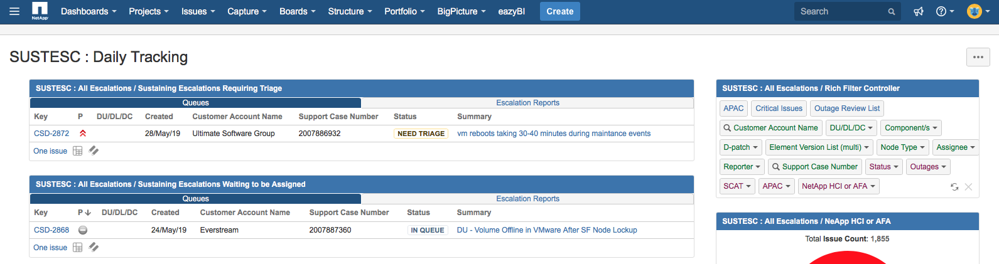
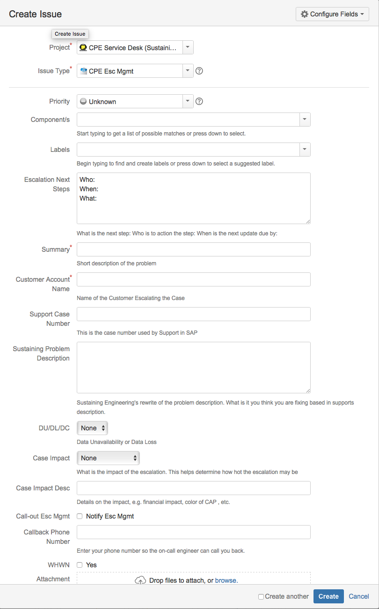

Creating Escalations 
===========================

Support will log into JIRA and create and escalation from the JIRA page. 

You can also create your own escalation by logging into the 'SUSTEC: Daily Tracking' JIRA page and clicking on the blue 'CREATE' button on the top of the page 

https://jira.ngage.netapp.com/secure/Dashboard.jspa?selectPageId=18505

You can then create custom options for the given escalation, 

Optionally you could create a JIRA ticket by sending an email to: cpe.escalations@gmail.com

The email channel will always create an issue of the 'CPE Help' type. 

