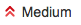
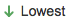

Escalation Triage Responsabilites
=================================

Triage responsability rotates with the on-call schedule; if you are on-call then you have the responsability of triaging incoming cases. 

* Response Time Objectives - Business Hours are 9-5 MT
* Best Practices 
* First Pass 
* Second Pass 
* 30 Minute Investigation 
* Move to the FIFO Queue 

Response Time Objectives - Business Hours are 9-5 MT
^^^^^^^^^^^^^^^^^^^^^^^^^^^^^^^^^^^^^^^^^^^^^^^^^^^^

.. list-table:: **Triage Response Time Objectives**
   :widths: 25 25 25 25
   :header-rows: 1

   * -
     - Triaged
     - Assigned
     - Response from Assignee (Handshake, or ack back to Support) 
   * - **Live (DU/DL/DC)**
     - NA
     - 20 minutes from escalation creation
     - 30 minutes from escalation creation
   * - **Type = DU/DL/DC or Priority-High**
     - 2 business hours from escalation creation
     - 4 business hours from escalation creation
     - 8 business hours from escalation creation
   * - **All other escalations**
     - 2 business hours from escalation creation
     - 12 business hours from escalation creation
     - 2 business days from escalation creation

Best Practices 
^^^^^^^^^^^^^^

* SCAT escalations are triaged by the SCAT (Sustaining Critical Accounts Team) team. 
* Communicate with the 'reporter' support engineer LIVE where ever possible. 
* The 'Issue Description' from support should include a detailed and targeted **timeline** and **problem statement**. This can dramatically shorten time to resolution. 
* Push Support to provide detial where missing, such as volume ID's, node ID's, timestamps, slice ID's, etc.
* Always add a 'Sustaining Problem Description'. 
* If you need help, reach out. 

First Pass
^^^^^^^^^^

Check that the required information is complete: 

1. Is the account a SCAT (Sustianing Critical Accounts Team) account, eg, AT&T, JPMC. 
	a. If yes, add a comment in HipChat room "SCAT" informing that "SCAT CSD-nnnn needs triage". 
	b. If no, continue working through this document to triage the escalation. 
2. Verify 'Type' is correct for this type of escalation described in the header: eg. if 'Header' = 'DU at Acme', make sure the 'Type' = 'CPE DU/DL/DC'. 
3. Verify the following are present: 
	a. "Element Version" 
	b. "Support Case Number" 
	c. "AIQ Link" 
	d. "Scratch Data Link" (verify the dir contains the logs and that permissions are set correctly so you can extract logs.) Verify the permissions on the directory and log files is 775. 
	e. "Issue Description" 
4. If any of the above is missing, add a comment asking Suppprt for the missing information and reach out to Support. Otherwise, add a comment: **"first pass complete"**

Second Pass 
^^^^^^^^^^^

Check that there is enough information to craft a sufficient 'Sustaining Problem Description': 

1. Read carefully through the 'Issue Description'. The issue description should include: 
	a. Technically detailed **timeline**; volume ID's, node ID's, slice service ID's, timestamps
	b. Intial symptoms 
	c. Customer Impact 
	d. Customer Response 
	e. Support Response 
2. Look for evidence that Support made an attempt to investigate the problem. 
3. If any of the above is missing, add a comment asking Support for the missing information. 
4. Add the following: 
	a. Dev Vertical (pick from list, ex, Element, Platforms, Ecosystem, HCI) 
	b. Components (pick from list) 
	c. Sustaining Problem Discretion 

30 Minute Investigation
^^^^^^^^^^^^^^^^^^^^^^^

Spend no more than 30 minutes investigating the problem. Look at AIQ, look at logs, dig into the timeline. Try to spot the cause/resolution without having the escalation assigned to an engineer. Then: 
	1. Add a comment describing your research and findings. 
	2. If the problem seems straightforward, assign the ticket to yourself. (Move the ticket to 'In Queue' before moving to 'Fix In Progress'. If you don't do that, the SLA timer keeps running)

Move to the FIFO Queue
^^^^^^^^^^^^^^^^^^^^^^

1. Change the 'Status' to 'In Queue' 
2. Add a comment to 'CPE-Support' HipChat room that ticket CSD-1234 has been triaged. 

.. note::
   Triage responsibility rotates with the on-call schedule; if you are on-call then you have the responsability of triaging incoming cases.  
 

Escalation Priority 
^^^^^^^^^^^^^^^^^^^

.. list-table:: **Escalation Priority** 
   :widths: 25 25 
   :header-rows: 1 

   * - State 
     - Priority 
   * - A DU/DL/DC is Pending in a short time frame (mins to hours) 
     - Highest
   * - Will occur often / business sensitivity to the esclation or account / Emails from support managers etc, asking from a shift in the speed of pickup 
     - High
   * - Prioritize depending on business impact  
     - Medium  
   * - Not regular cases (unique or one off situation) 
     - Low 
   * - Request for Enhancement (RFE)
     - Lowest 
   * - Need Triage / Not looked at yet 
     - Unknown 

This priority setting will adjust the In Queue view and prioritise the escalations with priority over the FIFO queue. 

 
