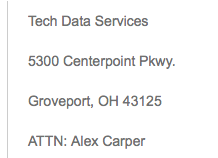

Hardware RCA | FA etc 
=================================

SFG Sustaining Engineering will not hangle hand hardware Failure Analysis (FA) for drives, nodes etc. NetApp has a group that will handle this and the process is documented on 

http://csops.netapp.com/customer-support-delivery/rca/

For exceptions to this where Sustaining and/or Engineering desire the hardware to be returned to Boulder, the following process should be adhereed to: 

	* Update the escalation ticket with a request to one of the Sustaining Managers highlighting the request and the action plan for the FA at Boulder 
	* Wait until the manager puts an Approved in the escalation then and only then can you inform support to return hardware to Boulder. 
		* From the manager side, if the request is from one of the development groups, then the action plan and approval for time should be obtained from the development manager. 

If hardware is mistakingly sent to Boulder we can get this back into process by
	* Returning the hardware to the following adress 

This is the 3PR (third party repair). They will recieve it and then process it to Jabil where the FA will be preformed. Include the support case number and CSD number. 

  

