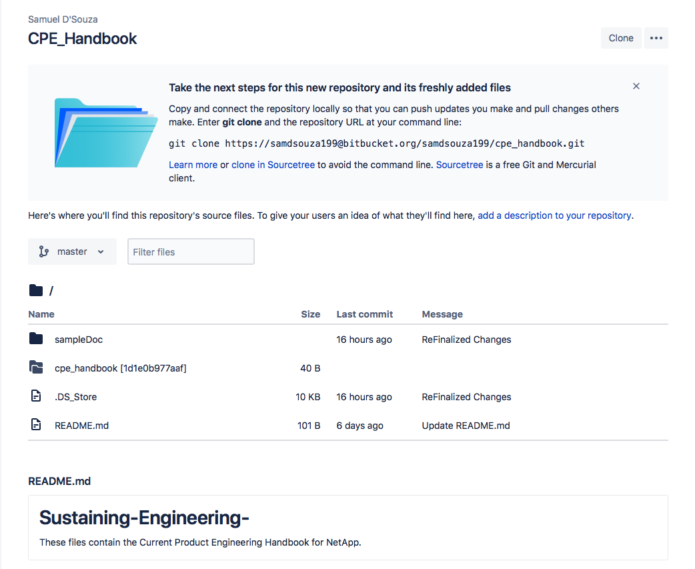

How to Edit this Document
=========================

This document is written in reStructuredText format. The content is stored at: https://github.com/samdsouza/Sustaining-Engineering-

In order to add to / edit this document, clone the repository to your local machine

A good place to reference in setting up this document is: https://docs.readthedocs.io/en/stable/intro/getting-started-with-sphinx.html

Detailed Steps for Installation 
^^^^^^^^^^^^^^^^^^^^^^^^^^^^^^^

In order to edit this document, make sure python is installed on your machine, 

Begin by entering the directory you downloaded, 'Sustaining-Engineering-' 

You will then need to install sphinx:: 

    $ pip install sphinx 
    
    Enter the 'sampleDoc' directory, 

    $ sphinx-quickstart

Quickstart will begin to walk you through the defaults, in most cases you can just accept the defaults but a thorough explanation of these defaults is found on: https://www.youtube.com/watch?v=oJsUvBQyHBs

After creating this document, you can now freely edit and add to the handbook. 

To preview the website / your changes::

    Enter the 'sampleDoc' directory 

    $ make html 

    Sphinx will then build the html file with the given changes that have been added, and to view this file, 

    $ open build/html/index.html

    You can now view this website in your web browser. 

In order to add new pages / edit pages:: 

    Enter the source directory 

    Utilize a virtual machine and edit this documents in the terminal 

    $ vim index.rst  // vim Monitoring\ Escalations.rst 

    You must then press "i" in order to begin to make changes to this document 

    Once the changes have been finalized, press "esc" and :wq to save these changes / :q! to discard these changes 

    You can now rebuild your html file to view these changes in your web browser. 

Good documentation to follow to make changes is shown here: http://openalea.gforge.inria.fr/doc/openalea/doc/_build/html/source/sphinx/rest_syntax.html#colored-boxes-note-seealso-todo-and-warnings

In order to push these changes to 'Read The Docs' and finalize your changes, make sure that your updates have been repushed to github, and login to readthedocs.org 

 

Testing123
^^^^^^^^^^ 
