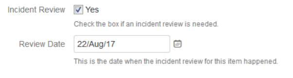
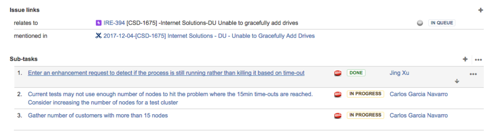
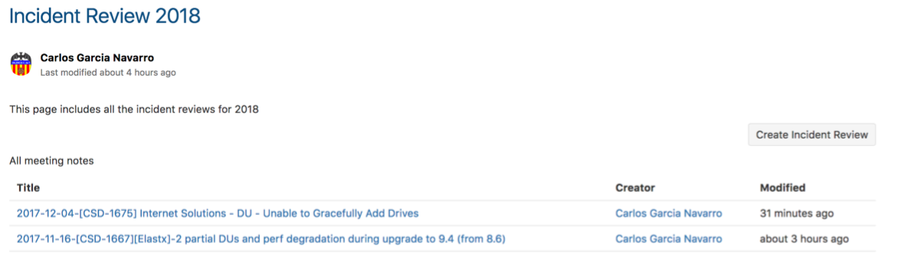

Incident Reviews
=====================

When to Have an Incident Review 
^^^^^^^^^^^^^^^^^^^^^^^^^^^^^^^

Incident reviews are technical discussions that happen on request and that involve representation from Support, Engineering (dev and test), CPE and Quality teams. During these meetings a summary of the case as well as the root cause are described and discussed. This information can be used by Support to be included in the final report to the customer. 

Incident reviews will be done for the following incidents: 

	* Every DL
	* Every other AFA (All Flash Arrays) incident for which an incident has been requested (on-demand) 
	* Every incident related to HCI (Hyper Converge Infastructure) (i.e. Dev Vertical is set to HCI) 

The query ("PQR - Need Incident Review") returns all the incidents that are due for an incident review. 

The query ("PQR - Scheduled Incident Reviews") returns all incidents for which we have scheduled an incident review. 

The query ("PQR - Reviewed Incident Reviews") returns all the incidents for which we had an incident review. 

How to Request an Incident Review 
^^^^^^^^^^^^^^^^^^^^^^^^^^^^^^^^^^

In order to request an incident review the "Incident Review" field needs to be checked when creating or editing the case: 

The CPE/Incident Review Program Manager (or any other person designated for this) will be in charge to review the request, that a root cause has been identified, and to confirm that the team is ready for the discussion, and will also schedule the review. These items will exist in the "IR meeting to be scheduled" swim lane. When scheduling the review the "review date" field will be set. If the date is set, the items will be included in the "IR meeting schedule swim lane". 

Incident Review Action Items
^^^^^^^^^^^^^^^^^^^^^^^^^^^^

Action items from the incident reviews will be created as sub-tasks (of the type action item) attatched to the CSD escalation that corresponds to the incident review: 

Incident Review Meeting Notes 
^^^^^^^^^^^^^^^^^^^^^^^^^^^^^

All notes from the Incident Reviews exist in Confluence. When a new incident review is scheduled, create a new incident review page using the 'Incident Review 2018' template. The page 'Incident Review 2018' includes a button ('Create Incident Review') that automatically creates a new page for the incident review using the mentioned template, as well as a table of contents with all the incident review pages: 

`Incident Review 2018 <https://confluence.ngage.netapp.com/display/IRE/Incident+Review+2018>`_ 

Incident Review Dashboard / Metrics 
^^^^^^^^^^^^^^^^^^^^^^^^^^^^^^^^^^^

The board contians information about: 

	* List of pending incident reviews 
	* List of scheduled incident reviews 
	* List of completed incident reviews 
	* Pie chart with action items per category 
	* Pie chart with action items per status per category 
	* Pie chart with total number of incident reviews per status (pending, scheduled, done) 
	* Pie chart with defects opened

https://ngage.netapp.com/secure/Dashboard.jspa?selectPageId=19723# 

