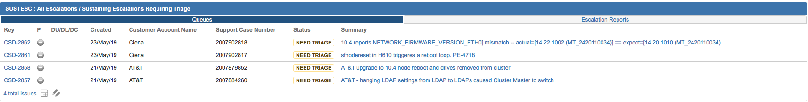

Monitoring Escalations 
=====================

Escalations come in to a queue within the JIRA based ServiceDesk implementation called CPE ServiceDesk or CSD for short. All escalations have a unique number that looks like CSD-XXXX. 

The best dashboard to use for monitoring the queue is https://ngage.netapp.com/secure/Dashboard.jspa?selectPageId=18505

An example of this dashboard is shown below, 

