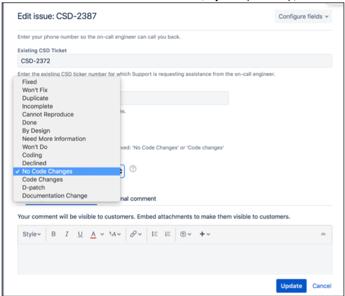

Resolving an Emergency Call-out ticket type
============================================

Resolve the 'Emergency Call-out' ticket as soon as the emergency call-out work is complete. Additional work for the problem such as an RCA needs to captured in a seperate ticket. 

	* Change the status of the escalation to "Resolved": 
	* Click 'Edit' and select a 'Resolution'. NOTE, is you skip this step, the ticket will show in your "Assigned to me" queue indefinitely, even though it is in a resolved status. 

