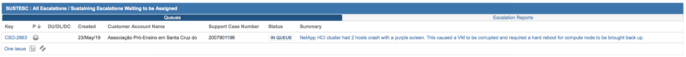

Select an Escalation from the FIFO Q
================================

This section refers to escalations of the type CPE DU/DL/DC, CPE Escalations and CPE Help. New escalations will show up in the JIRA report 'Sustaining Escalations Waiting to be Assigned' : https://jira.ngage.netapp.com/secure/Dashboard.jspa?selectPageId=18505

   

When selecting an escalation from the queue, do the following: 

	1. Pull the oldest 'DU/DL/DC' ticket.
	2. If no 'DU/DL/DC' tickets, pull the oldest 'CPE Escalation' ticket. 

 

