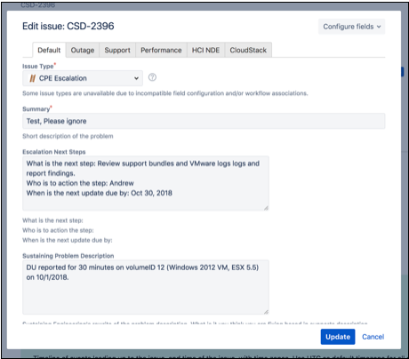
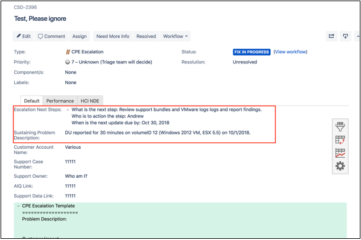
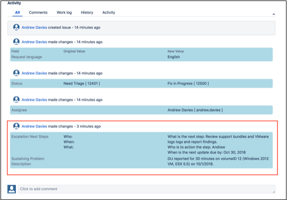

Sustaining Engineering Support Targetted Commitments 
=======================================================

Escalation Triage
^^^^^^^^^^^^^^^^^

All escalations except active DU/DL's (these are handled close to real time) enter an "Awaiting Triage" state. We are targetted to triage all escalations within 2 hours of filling between the hours of 0630MT and 1800MT. During Triage, the escalation will be assessed for completeness and updated if the problem description is not complete, logs are missing, etc. If the escalation is complete, the escalation will be moved to Sustaining Escalations Waiting to be Assigned. The triage engineer will also adjust the priority of the escalation which by default is not set based on: 

.. list-table:: **Escalation Priority**
   :widths: 25 25
   :header-rows: 1

   * - State
     - Priority
   * - A DU/DL/DC is Pending in a short time frame (mins to hours)
     - P1
   * - Will occur often / business sensitivity to the esclation or account / Emails from support managers etc, asking from a shift in the speed of pickup
     - P2
   * - Some other condition that may require a shift
     - P3
   * - Default State 
     - NULL

This priority setting will adjust the In Queue view and prioritise the escalations with priority over the FIFO queue. 

Sustaining Escalations Waiting to be Assigned
^^^^^^^^^^^^^^^^^^^^^^^^^^^^^^^^^^^^^^^^^^^^^

This is the incoming queue for NetApp HCL Sustaining Engineering. Cases are adressed in this priority unless there is a management override: 

	* Active DU/DL Escalations 
		
		* Withing 30 minutes per the on-call process for NetApp HCL Sustaining Engineering the escalation will be assigned and worked. 

	* DU/DL Escalations (Equivalent to P1/P2 in SAP) 
		
		* Assigned First in First Out until no more DU/DL Escalations are awaiting assignment 
 
		* We look to assignee these to sustaining within 3 days of filing 
 
		* Sustaining will try to provide a Software-based RCA within a 2 week timeframe form the time of filing
	
		* For Hardware related issues, the NetApp FA process can take months. We Will try and provide a Failure Analysis for Hardware within 3 months starting time of delivery to Jabil. 

	* Escalations 
		
		* Assigned First in First Out after all DU/DL Escalations are cleared 

		* We look to assign these within one week of filing 

Escalation Updates 
^^^^^^^^^^^^^^^^^^ 

Here are the three targets Sustaining has agreed with Support for owning tickets and for providing regular updates in escalation tickets: 

	* Sustaining engineers are expected to have a queue depth of no more than **seven** escalations of which only **two** should be **"Fix In Progress"**. 

	* All escalations with a status **"Fix In Progress"** will be updated **daily** through case comments in the "Escalation Next Steps" field. 

	* All escalations with a status **"Need More Information"** will be updated **weekly** through case comments in the "Escalation Next Steps" field. 
  

To update an escalation: 

1. Click 'Edit' 
2. Add an update to the 'Escalation Next Steps' field and ensure the 'Sustaining Problem Descirption' is accurate

3. Click 'Update' 

Your update will appear at the top of the ticket above the customer account name and at the bottom of the ticket in the "Activity / All" section. See below: 

4. Add ticket comments to the bottom of the ticket as needed. 

